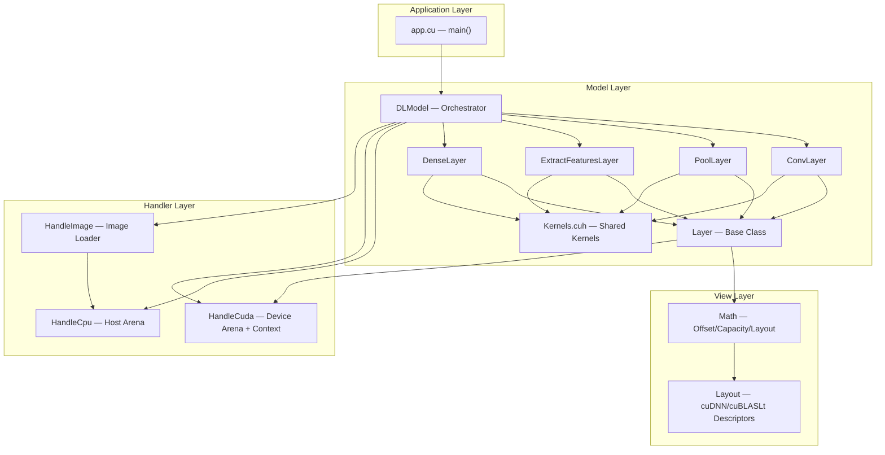

# CypherFramework AI Architecture

## Overview

The AI branch implements a mixed-precision (fp16 storage / fp32 compute) GPU digit recognizer using a **Handler → Model → View** (HMV) architecture pattern.

**Mixed-Precision Strategy:**
- **Storage:** `__half` (fp16) — halves memory bandwidth, enables Tensor Core paths
- **Compute:** `float` (fp32) — full precision for accumulation, numerically stable
- **Vectorization:** `uint4` loads = 128-bit = 8 `__half` values per load, aligned to 128-bit boundaries

## Architecture Diagram



## Memory Model

All tensor data lives in **pre-allocated arenas** (one CPU, one GPU). Individual tensors are **views** (offset + capacity) into these arenas, not independent allocations.

```
HandleCuda arena (2GB × sizeof(__half)):
┌──────────┬──────────┬──────────┬──────────┬────────────┐
│ ConvL.x  │ ConvL.w  │ ConvL.b  │ ConvL.z  │   ...      │
│ offset=0 │ offset=N │ offset=M │ offset=K │            │
└──────────┴──────────┴──────────┴──────────┴────────────┘
           ↑ bind() bumps offset, returns (offset, capacity) to Math
```

- `HandleCuda::bind(Math&)` → computes `sizeof(__half) * strides[0] * dim[0]`, aligns to 128 bits, sets offset/capacity on the Math view
- `HandleCpu::bind(Math&)` → same logic for host arena
- `HandleCpu::copyToDevice()` → creates Layout on device Math, binds it, `cudaMemcpy` from host to device

## Layer Hierarchy

```
Layer (base)
  ├── ConvLayer          — cuDNN conv2d + ReLU + backward (CUDNN_DATA_HALF)
  ├── PoolLayer          — cuDNN max-pool 2×2 (CUDNN_DATA_HALF)
  ├── ExtractFeaturesLayer — cublasGemmEx fp16 matmul + ReLU (CUDA_R_16F + CUBLAS_COMPUTE_32F)
  └── DenseLayer         — cublasGemmEx fp16 matmul + softmax/cross-entropy
```

Each layer owns its tensor views (`x, w, b, z, act, dz, dw, db, da`) as `Math` members. The base `Layer` class provides `setX()`, `setW()`, etc. which create the Layout and bind the Math view to the GPU arena.

## Training Pipeline

```
Input: 64 × 1 × 28 × 28 images (fp16)

  ┌─────────────────────────────────────────────────────┐
  │  1. ConvLayer::convXWpB()     [64,1,28,28] → [64,1,28,28]  │
  │     cuDNN conv2d, filter [1,1,3,3], pad=1, stride=1        │
  │     + cudnnAddTensor (bias)                                  │
  │                                                              │
  │  2. ConvLayer::activationReLU()                              │
  │     cuDNN activation forward (CUDNN_ACTIVATION_RELU)         │
  │                                                              │
  │  3. PoolLayer::maxPool()      [64,1,28,28] → [64,1,14,14]  │
  │     cuDNN 2×2 max pooling                                    │
  │                                                              │
  │  4. ExtractFeaturesLayer::linear()  [64,196] → [64,128]    │
  │     cublasGemmEx (Tensor Core), fp16 in, fp32 accumulate    │
  │     + addBiasKernel (fp16)                                   │
  │                                                              │
  │  5. ExtractFeaturesLayer::activationReLU()                   │
  │     reluForwardHalf2Kernel (uint4/half2 vectorized)          │
  │                                                              │
  │  6. DenseLayer::linear()      [64,128] → [64,10]           │
  │     cublasGemmEx (Tensor Core)                               │
  │     + addBiasKernel (fp16)                                   │
  │                                                              │
  │  7. DenseLayer::softmaxCrossEntropy()                        │
  │     __half → float → softmax → cross-entropy → float loss   │
  │     gradients written back as __half                         │
  └─────────────────────────────────────────────────────┘

Backward:
  DenseLayer::backLinear()        → dw, db, da
  DenseLayer::learnFunc(lr)       → sgdUpdateHalf2Kernel (vectorized)
  ExtractFeaturesLayer::backActivation() → reluBackwardHalf2Kernel
  ExtractFeaturesLayer::backLinear()     → dw, db, da
  ExtractFeaturesLayer::learnFunc(lr)    → sgdUpdateHalf2Kernel
  PoolLayer::backPool()           → cuDNN pooling backward
  ConvLayer::backActivation()     → cuDNN activation + filter backward
  ConvLayer::learnFunc(lr)        → sgdUpdateHalf (vectorized + tail)
```

## File Map

```
cypherFramework/
├── app/src/
│   └── app.cu                          # Entry point: train(32) + estimate
│
├── lib/src/
│   ├── HANDLER/
│   │   ├── HandleCpu.cu                # CPU arena (malloc/cudaMallocHost)
│   │   ├── HandleCuda.cu               # GPU arena + cuBLAS/cuDNN context
│   │   └── HandleImage.cu              # stbi image → __half conversion
│   │
│   ├── MODEL/
│   │   ├── Kernels.cuh                 # Shared kernels (ReLU, softmax, GEMM, SGD)
│   │   ├── ConvLayer.cu                # Conv forward/backward (cuDNN)
│   │   ├── PoolLayer.cu                # Pool forward/backward (cuDNN)
│   │   ├── ExtractFeaturesLayer.cu     # Hidden FC layer (cublasGemmEx)
│   │   ├── DenseLayer.cu               # Output layer + softmax+CE
│   │   ├── DLmodel.cu                  # DLModel orchestrator
│   │   └── Layer.cu                    # Base class setX/setW/setB...
│   │
│   └── VIEW/
│       ├── Layout.cu                   # cuDNN/cuBLASLt descriptor mgmt
│       └── Math.cu                     # View (offset + capacity + Layout*)
│
├── public/inc/
│   ├── HANDLER/
│   │   ├── HandleCpu.hpp
│   │   ├── HandleCuda.hpp
│   │   ├── HandleImage.hpp
│   │   └── stb_image.h
│   │
│   ├── MODEL/
│   │   ├── ConvLayer.hpp
│   │   ├── PoolLayer.hpp
│   │   ├── ExtractFeaturesLayer.hpp
│   │   ├── DenseLayer.hpp
│   │   ├── DLModel.hpp
│   │   └── Layer.hpp
│   │
│   └── VIEW/
│       ├── Layout.hpp
│       └── Math.hpp
│
└── Makefile                            # make app (build) / make run (build+run)
```

## Key Design Decisions

### Why fp16 Storage + fp32 Compute?
- **2× memory bandwidth reduction** — DRAM is the bottleneck for most GPU workloads
- **Tensor Core acceleration** — sm_70+ GPUs have dedicated fp16 matrix units (8× throughput)
- **Numerical stability preserved** — accumulation in fp32 prevents gradient underflow
- **uint4 vectorization** — 128-bit loads move 8 halfs per transaction, aligned to the arena's 128-bit boundaries

### Why Arena Allocation?
- **Zero fragmentation** — one `cudaMalloc` for the entire model
- **Deterministic layout** — offsets are computed at construction time
- **Fast reset** — `reset()` just sets offset = 0, no deallocation

### Why Header-Only Kernels?
- `Kernels.cuh` is `static` — each `.cu` TU gets its own copy
- Avoids cross-TU linking of `__global__` functions
- Kernels stay inlineable by the compiler
